# Kerststal 2025

ESP32-based nativity scene with:

- WS2812B LED strip control
- DFPlayer Mini audio playback
- Motor control for animations
- Multiple scenes

## Hardware

- ESP32
- WS2812B LED strip (90 LEDs)
- DFPlayer Mini
- DC Motor

## Build

```bash
idf.py build
idf.py flash monitor
```

## Overview electronics

```mermaid
graph TD
    %% ESP32 pins
    ESP32["ESP32 (15 pins)"]

    %% Power
    VCC5V["+5V voeding"]
    GND["GND"]

    %% LED strip
    LEDStrip["WS2812B LED-strip"]
    Res330["330Ω serie weerstand"]

    %% DFPlayer
    DFPlayer["DFPlayer Mini"]

    %% Motors
    Motor1["FS90R Motor 1"]
    Motor2["FS90R Motor 2"]
    Motor3["FS90R Motor 3"]
    Motor4["FS90R Motor 4"]

    %% Buttons
    Button1["Button 1"]
    Button2["Button 2"]
    Button3["Button 3"]

    %% Power connections
    VCC5V --> LEDStrip
    VCC5V --> DFPlayer
    VCC5V --> Motor1
    VCC5V --> Motor2
    VCC5V --> Motor3
    VCC5V --> Motor4

    GND --> LEDStrip
    GND --> DFPlayer
    GND --> Motor1
    GND --> Motor2
    GND --> Motor3
    GND --> Motor4
    GND --> Button1
    GND --> Button2
    GND --> Button3

    %% LED data
    ESP32 -->|GPIO14| Res330 --> LEDStrip

    %% DFPlayer UART
    ESP32 -->|GPIO26 TX| DFPlayer
    ESP32 -->|GPIO27 RX| DFPlayer

    %% Motors signal
    ESP32 -->|GPIO33| Motor1
    ESP32 -->|GPIO32| Motor2
    ESP32 -->|GPIO35| Motor3
    ESP32 -->|GPIO34| Motor4

    %% Buttons signal
    ESP32 -->|GPIO2| Button1
    ESP32 -->|GPIO15| Button2
    ESP32 -->|GPIO18| Button3
```


